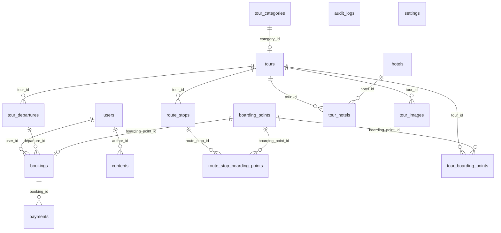

<!--
GENERATED FILE — do not edit by hand.

Regenerate with:
    docker compose run --rm --no-deps test python -m app.scripts.data_dictionary

`tests/test_data_dictionary.py` fails when this file and the models disagree.
-->

# Veri Sözlüğü

Şema `backend/app/models/` altındaki SQLAlchemy modellerinden üretilir; tabloları
veritabanına uygulayan zincir `backend/alembic/versions/` içindedir.

## Tablo ilişkileri

## Tablolar

### `audit_logs`

An append-only record of who moved money or seats, and when.

| Sütun | Tip | Boş geçilebilir | Varsayılan | Notlar |
| --- | --- | --- | --- | --- |
| `id` | UUID | hayır | `gen_random_uuid()` | PK |
| `seq` | BIGINT | hayır | `IDENTITY` | benzersiz, indeksli |
| `recorded_at` | TIMESTAMP WITH TIME ZONE | hayır | `clock_timestamp()` | — |
| `action` | ENUM(BOOKING_CREATED, BOOKING_CANCELLED, BOOKING_CONFIRMED, BOOKING_EXPIRED, PAYMENT_OPENED, PAYMENT_PAID, PAYMENT_REFUNDED) | hayır | — | indeksli |
| `actor_id` | UUID | evet | — | indeksli |
| `actor_email` | VARCHAR(255) | evet | — | — |
| `actor_is_superuser` | BOOLEAN | evet | — | — |
| `booking_id` | UUID | evet | — | indeksli |
| `payment_id` | UUID | evet | — | indeksli |
| `amount` | NUMERIC(10, 2) | evet | — | — |
| `detail` | JSONB | evet | — | — |

### `boarding_points`

Boarding points for tour pick-ups.

| Sütun | Tip | Boş geçilebilir | Varsayılan | Notlar |
| --- | --- | --- | --- | --- |
| `id` | UUID | hayır | `uuid4` (uygulama) | PK |
| `name` | VARCHAR(255) | hayır | — | indeksli |
| `description` | VARCHAR(500) | evet | — | — |
| `is_active` | BOOLEAN | hayır | `True` (uygulama) | — |
| `created_at` | TIMESTAMP WITH TIME ZONE | hayır | `CURRENT_TIMESTAMP` | — |
| `updated_at` | TIMESTAMP WITH TIME ZONE | hayır | `CURRENT_TIMESTAMP` | — |

### `bookings`

Tour booking entity with stock reservation tracking.

| Sütun | Tip | Boş geçilebilir | Varsayılan | Notlar |
| --- | --- | --- | --- | --- |
| `id` | UUID | hayır | `uuid4` (uygulama) | PK |
| `user_id` | UUID | hayır | — | FK → `users.id`, ON DELETE CASCADE, indeksli |
| `departure_id` | UUID | hayır | — | FK → `tour_departures.id`, ON DELETE RESTRICT, indeksli |
| `boarding_point_id` | UUID | evet | — | FK → `boarding_points.id`, ON DELETE SET NULL |
| `seat_count` | INTEGER | hayır | — | — |
| `total_price` | NUMERIC(10, 2) | hayır | — | — |
| `status` | ENUM(PENDING, CONFIRMED, CANCELLED) | hayır | `pending` (uygulama) | indeksli |
| `created_at` | TIMESTAMP WITH TIME ZONE | hayır | `CURRENT_TIMESTAMP` | — |
| `updated_at` | TIMESTAMP WITH TIME ZONE | hayır | `CURRENT_TIMESTAMP` | — |

### `contents`

A publishable content item authored by a user.

| Sütun | Tip | Boş geçilebilir | Varsayılan | Notlar |
| --- | --- | --- | --- | --- |
| `id` | UUID | hayır | `gen_random_uuid()` | PK |
| `title` | VARCHAR(255) | hayır | — | — |
| `slug` | VARCHAR(255) | hayır | — | benzersiz, indeksli |
| `body` | TEXT | hayır | — | — |
| `is_published` | BOOLEAN | hayır | `false` | — |
| `author_id` | UUID | hayır | — | FK → `users.id`, ON DELETE CASCADE, indeksli |
| `created_at` | TIMESTAMP WITH TIME ZONE | hayır | `CURRENT_TIMESTAMP` | — |
| `updated_at` | TIMESTAMP WITH TIME ZONE | hayır | `CURRENT_TIMESTAMP` | — |

### `hotels`

Accommodation used by tours, reusable across multiple tours.

| Sütun | Tip | Boş geçilebilir | Varsayılan | Notlar |
| --- | --- | --- | --- | --- |
| `id` | UUID | hayır | `uuid4` (uygulama) | PK |
| `name` | VARCHAR(255) | hayır | — | indeksli |
| `slug` | VARCHAR(255) | hayır | — | benzersiz, indeksli |
| `city` | VARCHAR(100) | hayır | — | indeksli |
| `address` | VARCHAR(500) | evet | — | — |
| `phone` | VARCHAR(50) | evet | — | — |
| `star_rating` | INTEGER | evet | — | — |
| `description` | TEXT | evet | — | — |
| `image_url` | VARCHAR(500) | evet | — | — |
| `is_active` | BOOLEAN | hayır | `True` (uygulama) | — |
| `created_at` | TIMESTAMP WITH TIME ZONE | hayır | `CURRENT_TIMESTAMP` | — |
| `updated_at` | TIMESTAMP WITH TIME ZONE | hayır | `CURRENT_TIMESTAMP` | — |

### `payments`

Mock payment record linked to a booking.

| Sütun | Tip | Boş geçilebilir | Varsayılan | Notlar |
| --- | --- | --- | --- | --- |
| `id` | UUID | hayır | `uuid4` (uygulama) | PK |
| `booking_id` | UUID | hayır | — | FK → `bookings.id`, ON DELETE CASCADE, indeksli |
| `amount` | NUMERIC(10, 2) | hayır | — | — |
| `method` | ENUM(CARD, TRANSFER) | hayır | — | — |
| `status` | ENUM(PENDING, PAID, FAILED, REFUNDED) | hayır | `pending` (uygulama) | indeksli |
| `transaction_id` | VARCHAR(64) | evet | — | — |
| `paid_at` | TIMESTAMP WITH TIME ZONE | evet | — | — |
| `refunded_at` | TIMESTAMP WITH TIME ZONE | evet | — | — |
| `created_at` | TIMESTAMP WITH TIME ZONE | hayır | `CURRENT_TIMESTAMP` | — |
| `updated_at` | TIMESTAMP WITH TIME ZONE | hayır | `CURRENT_TIMESTAMP` | — |

### `route_stop_boarding_points`

| Sütun | Tip | Boş geçilebilir | Varsayılan | Notlar |
| --- | --- | --- | --- | --- |
| `route_stop_id` | UUID | hayır | — | PK, FK → `route_stops.id`, ON DELETE CASCADE |
| `boarding_point_id` | UUID | hayır | — | PK, FK → `boarding_points.id`, ON DELETE CASCADE |

### `route_stops`

A single day/stop within a tour's itinerary (rota).

| Sütun | Tip | Boş geçilebilir | Varsayılan | Notlar |
| --- | --- | --- | --- | --- |
| `id` | UUID | hayır | `uuid4` (uygulama) | PK |
| `tour_id` | UUID | hayır | — | FK → `tours.id`, ON DELETE CASCADE, indeksli |
| `day_number` | INTEGER | hayır | `1` (uygulama) | — |
| `sort_order` | INTEGER | hayır | `0` (uygulama) | — |
| `title` | VARCHAR(255) | hayır | — | — |
| `description` | TEXT | evet | — | — |
| `is_active` | BOOLEAN | hayır | `True` (uygulama) | — |
| `created_at` | TIMESTAMP WITH TIME ZONE | hayır | `CURRENT_TIMESTAMP` | — |
| `updated_at` | TIMESTAMP WITH TIME ZONE | hayır | `CURRENT_TIMESTAMP` | — |

### `settings`

A globally scoped, explicitly documented application setting.

| Sütun | Tip | Boş geçilebilir | Varsayılan | Notlar |
| --- | --- | --- | --- | --- |
| `id` | UUID | hayır | `gen_random_uuid()` | PK |
| `key` | VARCHAR(100) | hayır | — | benzersiz, indeksli |
| `value` | JSONB | hayır | — | — |
| `description` | VARCHAR(255) | evet | — | — |
| `created_at` | TIMESTAMP WITH TIME ZONE | hayır | `CURRENT_TIMESTAMP` | — |
| `updated_at` | TIMESTAMP WITH TIME ZONE | hayır | `CURRENT_TIMESTAMP` | — |

### `tour_boarding_points`

| Sütun | Tip | Boş geçilebilir | Varsayılan | Notlar |
| --- | --- | --- | --- | --- |
| `tour_id` | UUID | hayır | — | PK, FK → `tours.id`, ON DELETE CASCADE |
| `boarding_point_id` | UUID | hayır | — | PK, FK → `boarding_points.id`, ON DELETE CASCADE |

### `tour_categories`

Category grouping for tours, e.g. 'Gunubirlik', 'Yurt Ici', 'Balayi'.

| Sütun | Tip | Boş geçilebilir | Varsayılan | Notlar |
| --- | --- | --- | --- | --- |
| `id` | UUID | hayır | `uuid4` (uygulama) | PK |
| `name` | VARCHAR(255) | hayır | — | indeksli |
| `slug` | VARCHAR(255) | hayır | — | benzersiz, indeksli |
| `is_active` | BOOLEAN | hayır | `True` (uygulama) | — |
| `created_at` | TIMESTAMP WITH TIME ZONE | hayır | `CURRENT_TIMESTAMP` | — |
| `updated_at` | TIMESTAMP WITH TIME ZONE | hayır | `CURRENT_TIMESTAMP` | — |

### `tour_departures`

Tour departure dates, pricing, and quota management.

| Sütun | Tip | Boş geçilebilir | Varsayılan | Notlar |
| --- | --- | --- | --- | --- |
| `id` | UUID | hayır | `uuid4` (uygulama) | PK |
| `tour_id` | UUID | hayır | — | FK → `tours.id`, ON DELETE CASCADE |
| `start_date` | DATE | hayır | — | indeksli |
| `end_date` | DATE | hayır | — | — |
| `price` | NUMERIC(10, 2) | hayır | — | — |
| `total_quota` | INTEGER | hayır | — | — |
| `available_seats` | INTEGER | hayır | — | — |
| `is_active` | BOOLEAN | hayır | `True` (uygulama) | — |
| `created_at` | TIMESTAMP WITH TIME ZONE | hayır | `CURRENT_TIMESTAMP` | — |
| `updated_at` | TIMESTAMP WITH TIME ZONE | hayır | `CURRENT_TIMESTAMP` | — |

### `tour_hotels`

Hotel assignment to a tour, ordered by night (gece sirasi).

| Sütun | Tip | Boş geçilebilir | Varsayılan | Notlar |
| --- | --- | --- | --- | --- |
| `id` | UUID | hayır | `uuid4` (uygulama) | PK |
| `tour_id` | UUID | hayır | — | FK → `tours.id`, ON DELETE CASCADE, indeksli |
| `hotel_id` | UUID | hayır | — | FK → `hotels.id`, ON DELETE CASCADE, indeksli |
| `night_order` | INTEGER | hayır | `1` (uygulama) | — |
| `is_active` | BOOLEAN | hayır | `True` (uygulama) | — |
| `created_at` | TIMESTAMP WITH TIME ZONE | hayır | `CURRENT_TIMESTAMP` | — |
| `updated_at` | TIMESTAMP WITH TIME ZONE | hayır | `CURRENT_TIMESTAMP` | — |

### `tour_images`

Gallery images for a tour.

| Sütun | Tip | Boş geçilebilir | Varsayılan | Notlar |
| --- | --- | --- | --- | --- |
| `id` | UUID | hayır | `uuid4` (uygulama) | PK |
| `tour_id` | UUID | hayır | — | FK → `tours.id`, ON DELETE CASCADE, indeksli |
| `url` | VARCHAR(500) | hayır | — | — |
| `sort_order` | INTEGER | hayır | `0` (uygulama) | — |
| `is_active` | BOOLEAN | hayır | `True` (uygulama) | — |
| `created_at` | TIMESTAMP WITH TIME ZONE | hayır | `CURRENT_TIMESTAMP` | — |
| `updated_at` | TIMESTAMP WITH TIME ZONE | hayır | `CURRENT_TIMESTAMP` | — |

### `tours`

Main tour product entity.

| Sütun | Tip | Boş geçilebilir | Varsayılan | Notlar |
| --- | --- | --- | --- | --- |
| `id` | UUID | hayır | `uuid4` (uygulama) | PK |
| `title` | VARCHAR(255) | hayır | — | — |
| `slug` | VARCHAR(255) | hayır | — | benzersiz, indeksli |
| `description` | TEXT | hayır | — | — |
| `days` | INTEGER | hayır | — | — |
| `nights` | INTEGER | hayır | — | — |
| `image_url` | VARCHAR(500) | evet | — | — |
| `is_active` | BOOLEAN | hayır | `True` (uygulama) | — |
| `category_id` | UUID | evet | — | FK → `tour_categories.id`, ON DELETE SET NULL, indeksli |
| `created_at` | TIMESTAMP WITH TIME ZONE | hayır | `CURRENT_TIMESTAMP` | — |
| `updated_at` | TIMESTAMP WITH TIME ZONE | hayır | `CURRENT_TIMESTAMP` | — |

### `users`

A user who can author and administer content.

| Sütun | Tip | Boş geçilebilir | Varsayılan | Notlar |
| --- | --- | --- | --- | --- |
| `id` | UUID | hayır | `gen_random_uuid()` | PK |
| `email` | VARCHAR(255) | hayır | — | benzersiz, indeksli |
| `full_name` | VARCHAR(150) | evet | — | — |
| `hashed_password` | VARCHAR(255) | hayır | — | — |
| `is_active` | BOOLEAN | hayır | `true` | — |
| `is_superuser` | BOOLEAN | hayır | `false` | — |
| `token_version` | INTEGER | hayır | `0` | — |
| `created_at` | TIMESTAMP WITH TIME ZONE | hayır | `CURRENT_TIMESTAMP` | — |
| `updated_at` | TIMESTAMP WITH TIME ZONE | hayır | `CURRENT_TIMESTAMP` | — |
